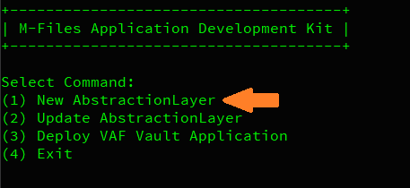
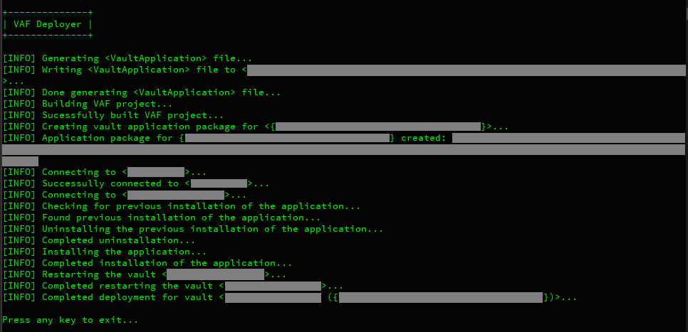

## Application Development Kit for M-Files
Helps expedite development of custom Vault Application logic.

**Application Development Kit for M-Files** is an M-Files COM-API Wrapper that
* maps Vault Structure to C# Classes bringing your vault structure to IntelliSense
* provides extensions to the COM-API
* allows development of complex logic in few lines of code
* strong typing on Property Definitions

** Requires M-Files Client and Admin and not currently designed to support Replicated Vaults
<br></br>
## Develop to Deploy

### A. Generate Code for your Vault Structure
Generate the Abstraction Layer by running **Application Development Kit for M-Files** console app. 
Select option `(1) New AbstractionLayer` to populate the code files for the VAF project.
<br></br>


This operation will populate the equivalent *Models* files of the Vault's metadata structure to the **VAF\Models** directory.
Subsequent Admin configuration changes should prompt an update to code via step `(2) Update AbstractionLayer`
<br></br>
### B. Implement Object Type Event Handlers

In addition to the *Models* files, the **VAF\EventHandlers** is also generated with a sample object type event handler class. Custom VAF business logic can be implemented into the event handler method as shown below.

*VAF\EventHandlers\Document.cs*
```c#
namespace VAF
{
	public class Document : OT_Document
	{
		[MFEventHandlerBeforeCheckInChanges]
		void checkin()
		{
			if (VersionNumber == 1)
				Name_or_title += $" [version 1 {CreatedDate.ToString("yyyy-MM-dd")}]";
		}
	}
}
```
<br></br>
### C. Deploy
Run **Application Development Kit for M-Files** console app again and select the `(3) Deploy VAF Vault App` to deploy the VAF application to the vault.
<br></br>
